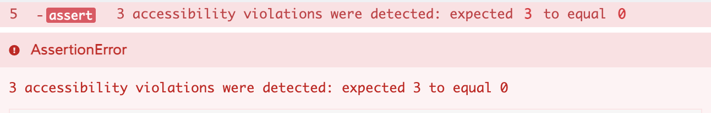
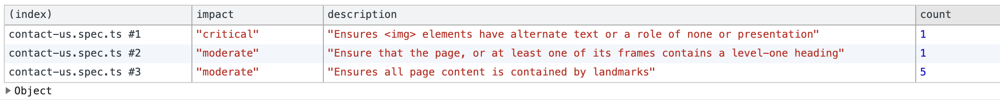

# cypress-axe-core

[](https://www.npmjs.com/package/cypress-axe-core) [](https://github.com/mcha-dev/cypress-axe-core/actions)

Test accessibility with [axe-core](https://github.com/dequelabs/axe-core) in [Cypress](https://cypress.io).

## ⚠️ UPDATE: [cypress-axe](https://github.com/component-driven/cypress-axe) now supports Cypress 8 ([latest release](https://github.com/component-driven/cypress-axe/releases/tag/v0.13.0)). So you should consider using/switching to the orignal package.

> ### Forked from [cypress-axe](https://github.com/component-driven/cypress-axe) ⑂
>
> **Reasons**:
>
> - to upgrade dependencies (i.e. `Cypress ^7` & `axe-core ^4`)
> - [RFC 75](https://github.com/component-driven/cypress-axe/issues/75) 👀

1. [Installation and Setup](#Installation-and-Setup)
   - [Typescript](#TypeScript)
2. [Examples](#Examples)
   - [Simple](#Simple)
   - [Customised](#Customised)
3. [Commands](#Commands)
   - [cy.injectAxe](#cyinjectAxe)
   - [cy.checkA11y](#cycheckA11y)
   - [cy.configureCypressAxe](#cyconfigureCypressAxe)
   - [cy.configureAxe](#cyconfigureAxe)

# Installation and Setup

1. **Install** required packages. Assuming you have Cypress installed already, you will only need to:

```sh
npm install --save-dev axe-core cypress-axe-core
```

2. **Include** the commands by importing `cypress-axe-core` in `cypress/support/index.js` file:

```js
import 'cypress-axe-core'
```

3. **Enable** results logging by defining cy.tasks in `cypress/plugins/index.js` file:

```js
module.exports = (on, config) => {
  on('task', {
    log(message) {
      console.log(message)
      return null
    },

    table(message) {
      console.table(message)
      return null
    }
  })
}
```

> **NOTE**: You can control how results are displayed via [the `violationsCb` config option](#cyconfigureCypressAxe)

After following the steps above (_and defining cy.tasks_), violations will be displayed as follows:

- Cypress 

- Terminal 

- Browser 

### TypeScript

If you’re using TypeScript, add `cypress-axe-core` types to your Cypress’s `tsconfig.json` file:

```json
{
  "compilerOptions": {
    "baseUrl": "./",
    "target": "es5",
    "lib": ["esnext", "dom"],
    "types": ["cypress", "cypress-axe-core"]
  },
  "include": ["."]
}
```

# Examples

## Simple

```js
it('passes axe', () => {
  cy.visit('/')
  cy.injectAxe()
  // ...

  cy.checkA11y() // checks the whole document

  cy.get('#mobile-menu').checkA11y() // checks id="mobile-menu only

  cy.wrap({ exclude: ['.not-me'] }).checkA11y() // checks the whole document except class=".not-me"
})
```

## Customised

Leveraging [Cypress commands](https://docs.cypress.io/api/cypress-api/custom-commands), you can create your own custom command that calls `cy.checkA11y` with the config you want. For example, if you only want to assert against _serious_ & _critical_ violations but ignore _color-contrast_ rule, you can do something like this:

```js
// cypress/support/commands.js
Cypress.Commands.add(
  'checkAxeViolations',
  { prevSubject: 'optional' },
  (context, options, label) => {
    cy.wrap(context).checkA11y(
      {
        shouldFailFn: violations =>
          violations.filter(
            v =>
              v.id !== 'color-contrast' &&
              ['serious', 'critical'].includes(v.impact)
          ),
        ...options
      },
      label
    )
  }
)

// some.spec.js
it('passes custom axe tests', () => {
  cy.visit('/')
  cy.injectAxe()
  // ...
  cy.checkAxeViolations() // 👈
})
```

# Commands

## cy.injectAxe

This will inject the `axe-core` runtime into the page under test. You must run this **after** a call to `cy.visit()` and before you run the `checkA11y` command.

You run this command with `cy.injectAxe()` either in your test, or in a `beforeEach`, as long as the `visit` comes first.

```js
beforeEach(() => {
  cy.visit('http://localhost:9000')
  cy.injectAxe()
})
```

## cy.checkA11y

When not chained to another element, it will run against the whole document. You can have it at the end of your test (after other interaction assertions) so it checks against all possible violations. It accepts the same (optional) config object that [`cy.configureCypressAxe`](#cyconfigureCypressAxe) accepts

**Note**: if you have a toggle-able element i.e. a side menu, make sure it's on (shown) by the time `cy.checkA11y` is called, otherwise you might end up with some false-positive cases. Or, you can target those elements directly to make sure they're tested

```js
cy.get('#menu-button').click()
cy.get('#side-menu-container').checkA11y()
```

## cy.configureCypressAxe

Instead of wrapping or overwriting `cy.checkA11y`, you can configure it. It accepts the following:

- `axeOptions` passed to axe-core.
- `shouldFailFn` function that returns array of violations to check for.
- `skipFailures` if true, it will log the violations but not assert against them.
- `violationsCb` reporter function that receives the result.

**The default** `violationsCb` function assumes that `cy.task('log')` and `cy.task('table')` have been defined already during the [Installation & setup](#Installation-and-Setup). If you don't want to define those tasks, you can pass a function here to control how results are outputted.

```js
cy.configureCypressAxe({
  axeOptions: [], // axe.RunOptions[]
  shouldFailFn: violations => violations,
  skipFailures: false,
  violationsCb: ({
    filename: 'test.spec.ts', // spec filename
    results: [], // violations axe.Result[]
    label: 'my custom component', // if passed to checkA11y
  }) => void,
})
```

## cy.configureAxe

To configure the format of the data used by aXe. This can be used to add new rules, which must be registered with the library to execute.

#### Description

User specifies the format of the JSON structure passed to the callback of axe.run

[Link - aXe Docs: axe.configure](https://www.deque.com/axe/documentation/api-documentation/#api-name-axeconfigure)

```js
it('Has no detectable a11y violations on load (custom configuration)', () => {
  // Configure aXe and test the page at initial load
  cy.configureAxe({
    branding: {
      brand: String,
      application: String
    },
    reporter: 'option',
    checks: [Object],
    rules: [Object],
    locale: Object
  })
  cy.checkA11y()
})
```

## Authors

The project was created by [Andy Van Slaars](https://vanslaars.io/), and maintained by [Artem Sapegin](https://sapegin.me).

## Contributors

Thanks goes to these wonderful people ([emoji key](https://github.com/all-contributors/all-contributors#emoji-key)):

<!-- ALL-CONTRIBUTORS-LIST:START - Do not remove or modify this section -->
<!-- prettier-ignore-start -->
<!-- markdownlint-disable -->
<table>
  <tr>
    <td align="center"><a href="https://samcus.co"><br /><sub><b>Samuel Custer</b></sub></a><br /><a href="https://github.com/component-driven/cypress-axe/commits?author=samcus" title="Code">💻</a> <a href="https://github.com/component-driven/cypress-axe/commits?author=samcus" title="Documentation">📖</a></td>
    <td align="center"><a href="https://github.com/miketoth"><br /><sub><b>Michael Toth</b></sub></a><br /><a href="https://github.com/component-driven/cypress-axe/commits?author=miketoth" title="Code">💻</a></td>
    <td align="center"><a href="https://github.com/NicholasBoll"><br /><sub><b>Nicholas Boll</b></sub></a><br /><a href="https://github.com/component-driven/cypress-axe/commits?author=NicholasBoll" title="Code">💻</a></td>
    <td align="center"><a href="https://github.com/michaeljacobdavis"><br /><sub><b>Mike Davis</b></sub></a><br /><a href="https://github.com/component-driven/cypress-axe/commits?author=michaeljacobdavis" title="Code">💻</a></td>
    <td align="center"><a href="https://github.com/chit786"><br /><sub><b>chit786</b></sub></a><br /><a href="https://github.com/component-driven/cypress-axe/commits?author=chit786" title="Code">💻</a> <a href="https://github.com/component-driven/cypress-axe/commits?author=chit786" title="Documentation">📖</a></td>
    <td align="center"><a href="https://github.com/acourdavault"><br /><sub><b>Adrien courdavault</b></sub></a><br /><a href="https://github.com/component-driven/cypress-axe/commits?author=acourdavault" title="Code">💻</a></td>
    <td align="center"><a href="http://brett-zamir.me"><br /><sub><b>Brett Zamir</b></sub></a><br /><a href="https://github.com/component-driven/cypress-axe/commits?author=brettz9" title="Code">💻</a></td>
  </tr>
</table>

<!-- markdownlint-enable -->
<!-- prettier-ignore-end -->

<!-- ALL-CONTRIBUTORS-LIST:END -->

This project follows the [all-contributors](https://github.com/all-contributors/all-contributors) specification. Contributions of any kind welcome!

## License

MIT License, see the included [License.md](License.md) file.
